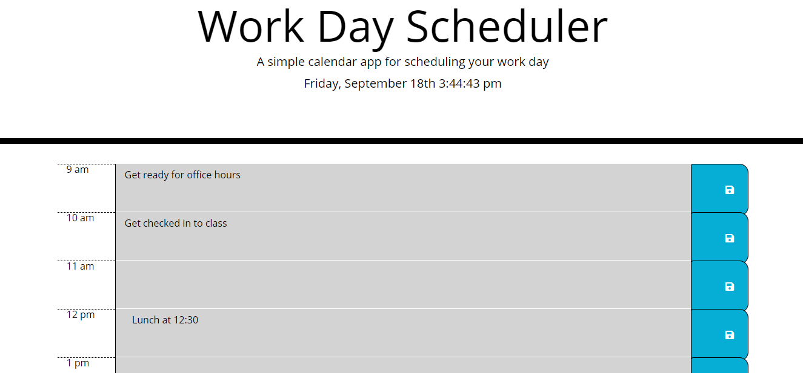

# Work-Day-Scheduler
Third party APIs
A work day schedule planner with current time.

This is a schedule planner that allows the user to enter information and save it to local storage. It also shows the user the present (red), past (grey), and future (green).

Created by: Erika Zibelnik